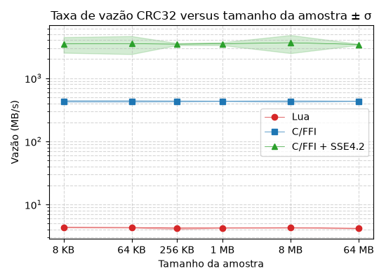

# libluacrc32
[](https://www.iso.org/standard/37010.html)
[](https://github.com/oAGoulart/libluacrc32/releases)
[](https://github.com/oAGoulart/libluacrc32/tree/master?tab=MS-RL-1-ov-file)
[](https://www.lua.org/download.html)

Lua 5.5 library to generate 32-bits cyclic redundancy checks. Code includes four pre-generated lookup tables for six different methods.

**Methods available:**
1. ISO-HDLC (default)
1. ISCSI (with SSE 4.2)
1. JAMCRC
1. MPEG-2
1. BZIP2
1. CD-ROM-EDC

## Usage

Binaries for AMD64 are available on [Releases](https://github.com/oAGoulart/libluacrc32/releases) page. For x86, compile with gcc or use `build.sh` script. If on Windows, use MinGW/MSYS2 with `CFLAGS` and `LFLAGS` set to include and library paths, respectively.

```sh
env CFLAGS=-IC:/msys64/usr/local/include \
    LFLAGS=-LC:/msys64/usr/local/bin ./build.sh
```

Then, require and call with a string to calculate its CRC. First and second arguments of `calculate` are `strings`, the latter is which method to use.

```lua
local crc32 = require("libluacrc32")

print(crc32.calculate("wrappem", "ISCSI"))
-- output: 969553473
```

> [!NOTE]
> If the Lua code above fails with `module 'libluacrc32' not found` on Windows, add `package.cpath=".\\?.dll"` one line before `require` or change your `LUA_CPATH` environment variable to include `.\\?.dll`.

## Benchmark



|Key|Benchmark context|
|--:|:--|
|environment|single-core execution @ 2.10 GHz (amd64); Lua 5.5; library compiled with gcc -O3; target throughput of up to 128 MiB; ten retries per sample.|
|max. thoughput|method ISCSI with SSE 4.2 opcodes @ ~4GiB/s ± σ of ~65MiB/s.|
|min. thoughput|within pure Lua implementation @ ~4MiB/s ± σ of ~0.05MiB/s.|

## Further reading
1. [Catalogue of parametrised CRC algorithms with 17 or more bits](https://reveng.sourceforge.io/crc-catalogue/17plus.htm).
